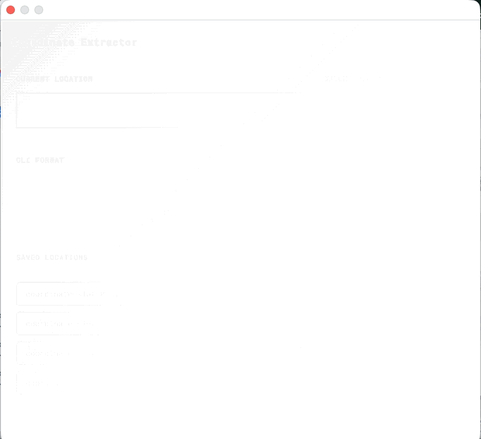
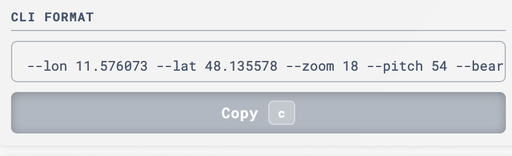
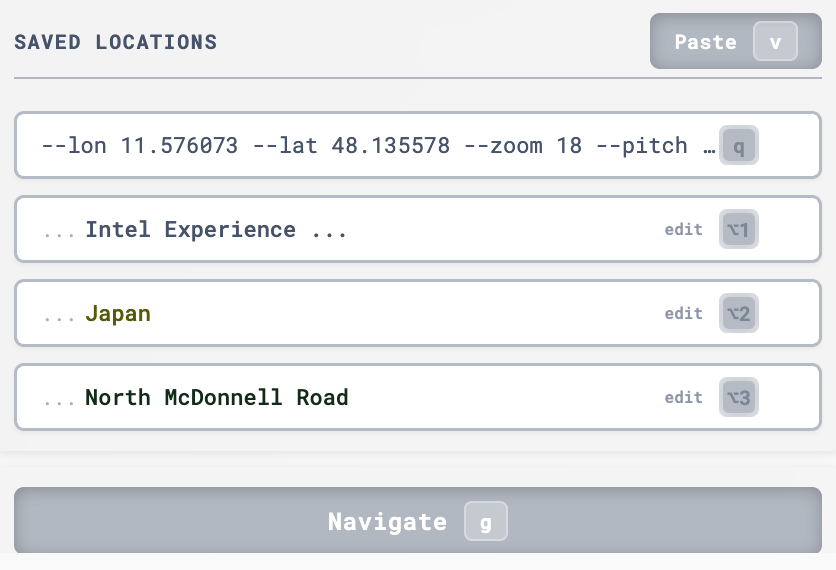
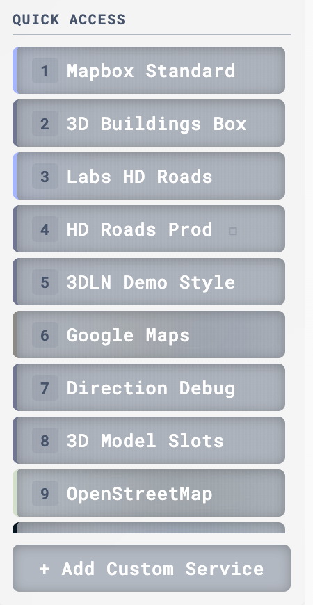

# 🧭 Coordinate Extractor v3.2.0

A powerful Chrome extension that automatically extracts geographic coordinates (latitude, longitude, zoom, pitch, bearing) from map URLs. Works with most popular mapping services.

## ✨ Features

- **⚡ Fast Coordinate Extraction**: Automatically parses coordinates from URLs
- **🌍 Universal Support**: Works with various URL formats and mapping services
- **📋 4 Storage Slots**: Save and manage up to 4 coordinate sets with instant saving
- **⌨️ Keyboard Shortcuts**: Quick actions with hotkeys
- **🌐 Automatic Location Names**: Background geocoding for slots 1-3 (coordinates save immediately)
- **🎨 Color-Coded Labels**: Customize slot names with colors
- **🗺️ Service Navigation**: Quick access to multiple map services with drag-and-drop reordering
- **🎯 Hotkeys for Services**: Direct navigation to services with keys 1-9
- **🔄 Alternative Service URLs**: Hold Shift and click to access alternative service versions with color-coded indicators
- **🎨 Service Visual Identity**: Colored borders and background images based on service branding
- **✨ Visual Feedback**: Icon rotation animation shows when extension is loading

---

## 📸 Screenshots & Demo

### Main Interface

---

## 🚀 Installation

1. Download or clone this repository
2. Open Chrome and navigate to `chrome://extensions/`
3. Enable **Developer mode** (toggle in the top-right)
4. Click **Load unpacked** and select the extension folder
5. The Coordinate Extractor icon will appear in your toolbar

---

## 🔍 How It Works

### Automatic Extraction
When you open the popup, the extension automatically extracts coordinates from the current tab's URL. Supported formats:
- Path format: `/@lat,lon,zoom`
- Hash format: `#zoom/lat/lon` or `#map=zoom/lat/lon`
- Query parameters: `?lat=X&lon=Y&zoom=Z`
- Special formats: `ll=`, `cp=`, `center=`

### Storage Slots
- **Slot 0**: Always shows coordinates from the current URL (read-only)
- **Slots 1-3**: Save custom coordinates with editable names and colors

---

## ⌨️ Hotkeys

### Coordinate Slots
| Shortcut | Action |
|----------|--------|
| **Command+Shift+E** (Mac) / **Ctrl+Shift+E** (Windows/Linux) | Open extension popup |
| **Option+1, 2, 3, 4** | Select slot 0, 1, 2, or 3 |
| **C** | Copy coordinates to clipboard |
| **V** | Paste coordinates from clipboard |
| **G** | Open service navigation modal |
| **E** | Edit active slot's label |
| **Q** | Select slot 0 |
| **Delete/Backspace** | Clear active slot |

### Service Navigation
| Shortcut | Action |
|----------|--------|
| **1-9** | Navigate directly to service 1-9 |
| **Shift + Click** | Access alternative version of service (if available) |
| **Drag & Drop** | Reorder services to your preference |

---

## 📚 Usage Examples

### Visual Guide

#### Extracting Coordinates
1. Navigate to any map website (e.g., Google Maps, Mapbox)
2. Click the extension icon
3. Coordinates are automatically extracted and displayed



#### Saving to Slots
1. Extract or paste coordinates
2. Select slot 1, 2, or 3
3. Press **V** to paste
4. Location name appears automatically



#### Switching between services
1. Choose Service from "Quick Access"
1.1. For alternative version of services hold Shift
2. Press hotkey 1-9 or left mouse click on Service button
3. Required service will open in new tab



---

### Text Examples

### Example 1: Extract Coordinates
1. Navigate to any map website
2. Click the extension icon
3. Coordinates are automatically displayed in slot 0

### Example 2: Save Location
1. Extract coordinates (or paste from clipboard)
2. Select slot 1, 2, or 3
3. Press **V** to paste
4. Coordinates are saved immediately
5. Location name appears automatically in the background (via geocoding)
6. Click the ✏️ icon to customize the name

### Example 3: Navigate
1. Select a slot with saved coordinates
2. Navigate to a map website
3. Press **G** to update the URL with those coordinates

### Example 4: Use Alternative Services
1. Hold **Shift** key
2. Click **3D Buildings Box** → Opens **3DLN Demo Box** (orange highlight)
3. Click **Labs HD Roads** → Opens **Labs HD 3DLN Demo** (deep purple highlight)
4. Click **Google Maps** → Opens **Google Earth** (blue highlight)
5. Click **3D Model Slots** → Opens **Footprint** (purple highlight)

---

## 🛠️ CLI Format

Coordinates are stored in CLI format:
```
--lon 2.2768 --lat 48.85891 --zoom 13.75
```

With rotation and tilt (when needed):
```
--lon 2.2768 --lat 48.85891 --zoom 13.75 --bearing 45 --pitch 60
```

**Note**: Bearing and pitch are only included when non-zero to ensure compatibility with all mapping services.

---

## 🌍 Geocoding

Slots 1-3 automatically fetch location names using OpenStreetMap's Nominatim API:
- **Coordinates save immediately** - no waiting for geocoding
- Location names are fetched in the background after coordinates are saved
- Shows "Loading location..." while fetching the name
- Displays short, readable location names
- Names are editable and persist across sessions
- Color-coded for easy identification
- Coordinates are preserved even if geocoding fails or is slow

---

## 🗺️ Supported Map Services

The extension supports navigation to multiple map services:
- **Mapbox Standard** - Standard Mapbox style
- **3D Buildings Box** / **3DLN Demo Box** (Shift) - 3D building visualizations
- **Labs HD Roads** / **Labs HD 3DLN Demo** (Shift) - High-definition road mapping
- **HD Roads Prod** / **HD Roads Demo** (Shift) - Production HD roads tileset
- **3DLN Demo Style** - 3D line navigation demo
- **Google Maps** / **Google Earth** (Shift) - Street and satellite imagery
- **3D Model Slots** / **Footprint** (Shift) - 3D model visualization
- **OpenStreetMap** - Open-source map data
- **Bing Maps** - Microsoft mapping service
- **Yandex Maps** - Russian mapping service

**Tip**: Hold **Shift** and click a service button to access its alternative version. The button will highlight in a color matching the alternative service theme.

You can add custom services by clicking the "+ Add Custom Service" button and providing a service name and URL template with example coordinates.

---

## ⚠️ Common Issues

| Issue | Solution |
|-------|----------|
| Coordinates not found | Ensure the URL contains valid coordinate data |
| Clipboard error | Allow clipboard access in Chrome settings |
| Wrong coordinates | Some services use different coordinate orders - try a different slot |
| Location name not loading | Coordinates are saved; name will appear when geocoding completes. You can edit the name manually if needed |
| Extension icon spinning | The icon rotates while the extension popup is loading |

---

## 🏗️ Technical Details

### Architecture
```
src/
├── core/
│   ├── app.js              # Main application logic
│   ├── browserManager.js   # Tab and URL management
│   └── storageManager.js   # Chrome storage API wrapper
├── parsers/
│   └── coordinateParser.js # Universal coordinate parser
├── ui/
│   ├── uiComponents.js     # UI rendering and interactions
│   └── serviceModal.js     # Service navigation with drag-and-drop
└── utils/
    ├── cliParser.js        # CLI string parsing
    └── geocoder.js         # Location name fetching
```

### Performance
- Fast URL parsing (~0.1-0.5ms average)
- Precompiled regex patterns
- Efficient coordinate validation
- Minimal memory footprint

---

## 📝 Changelog

See [CHANGELOG.md](CHANGELOG.md) for the complete version history and detailed release notes.

---

## 📄 License

MIT License - see LICENSE file for details.

---

## 🙏 Acknowledgments

- OpenStreetMap for the Nominatim geocoding API
- All mapping service providers
- Chrome Extension API

---

**Enjoy seamless coordinate extraction!** 🌍🎯
